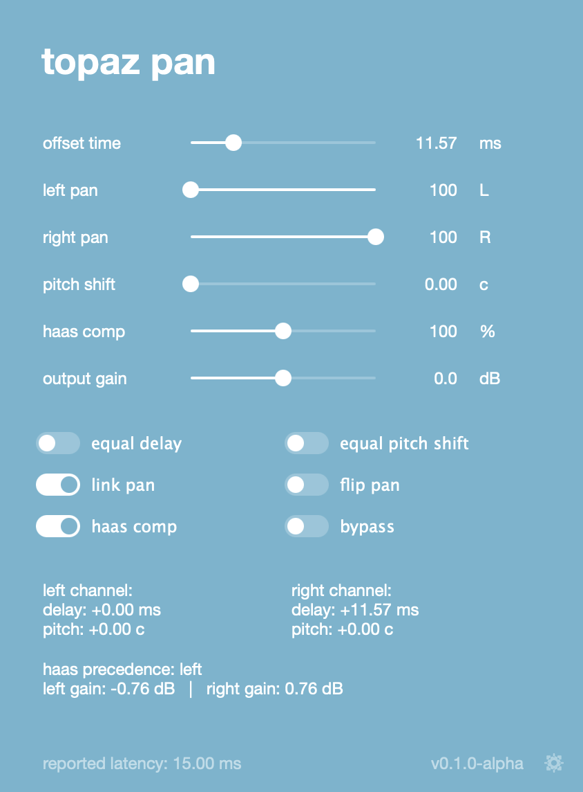

<p align="center">
  
</p>

<p align="center">
  とにかくシンプルな、ステレオボーカルワイドナープラグイン。
</p>

<p align="center">
  <a href="./README.md">English</a> · <strong>日本語</strong>
</p>

<p align="center">
  <a href="https://github.com/Pachii/topaz-pan/releases">
    
  </a>
  <a href="https://github.com/Pachii/topaz-pan/actions/workflows/build-vst3.yml">
    
  </a>
  
  
  <a href="https://github.com/Pachii/topaz-pan/stargazers">
    
  </a>
</p>

<p align="center">
  <a href="https://github.com/Pachii/topaz-pan/releases">releases</a>
  ·
  <a href="#なぜ作ったのか">なぜ作ったのか</a>
  ·
  <a href="#インストール">インストール</a>
  ·
  <a href="#ソースからビルド">ソースからビルド</a>
  ·
  <a href="#コントリビュート">コントリビュート</a>
</p>

---

ハモリを広げたいだけなのに、トラック複製の管理で DAW が散らかるのが嫌で作った、小さなプラグインです。

Haas effect ベースのシンプルなワイドニング、微小ピッチシフト、L/R パン、任意の左右音量補正をまとめていて、トラックに挿すだけでかなり素直に使えるようにしています。

## なぜ作ったのか

このプラグインは、歌ってみたでよく使われるバックコーラスの広げ方を、できるだけそのまま再現しやすくするために作りました。かなり自然に広がったハモリを作れます。

やっていること自体は本当に単純です。

1. ボーカルトラックを複製する
2. 片方をほんの少しだけ後ろにずらす
3. 2 本を左右に振る

「そんなので本当に広がるの？」と思うかもしれませんが、まふまふのミックス動画でも、まさにこういうやり方が出てきます。

https://www.youtube.com/watch?v=pwHqy9cKi7c&t=2604s

歌ってみたやその周辺の文脈を知らなくても大丈夫です。バックボーカルやハモリを、できるだけ自然に広げたい場面なら普通に使えます。歌ってみたのことに触れているのは、このやり方がそこでかなり定番だからです。

そしてここからが本題ですが、この手法を普通に DAW でやろうとすると地味にしんどいです。

- ハモリトラックを複製する
- かなり拡大して、片方を細かくずらす
- 左右にパンする
- 後から直しが入ったら、複製した側ももう一回直す
- Melodyne や 他の補正 の作業まで含めると、ただただ面倒
- しかもトラック数が増えて DTM が散らかる

この問題を解決しようとするプラグインは一応ありますが、この「ただ複製して少しずらしたいだけ」という用途には妙に噛み合いませんでした。

- **iZotope Vocal Doubler** は一応それっぽいですが、設定も挙動もそこまで素直ではなく、変な位相感やピッチのふらつき、場合によってはかなりきつい歪みまで出ます。普段使っている人も、過去プロジェクトで単体ソロして聞くと「思ってたより変だな」となるかもしれません。
- **Soundtoys MicroShift** はかなり良いです。でも高いし、そもそも「ボーカルをこの用途でシンプルに広げたい」に完全特化しているわけではありません。

要するに、「音を複製して少し時間差をつけるだけ」のプラグインが意外と無かったので、自分で作りました。

このプラグインは、各パラメータが音に対して何をしているかをかなりはっきり見えるようにしています。謎のモジュレーションやブラックボックスな処理は入れていません。追加機能はありますが、要らなければ全部切れます。

なので、極端に言えば「DAW 上で手作業で複製してずらした結果」と同じところまでかなり寄せられます。ただし、複製トラックを管理する面倒は要りません。

---

## スクリーンショット



---

## 仕組み

大まかには、次の 3 つを組み合わせています。

- 少しの時間差
- 少しのピッチ差
- 左右への配置

この組み合わせだけでも、ハモリやダブルはかなり広く聞こえます。

### Haas effect

ワイドニングの中心にあるのは、いわゆる「Haas effect」です。片側がもう片側よりほんの少しだけ遅れて届くと、耳は露骨なエコーとしてではなく、広がりや方向感として先に認識します。

### Haas comp

片側だけを遅らせると、遅らせていない側のほうが大きく聞こえて、定位が偏って感じることがあります。このコントロールは、その偏りを抑えるために左右の音量を同時に調整します。

---

## パラメータ

| Control | 説明 |
| --- | --- |
| `offset time` | 幅を作るための Haas ディレイ量を設定します。 |
| `left pan` / `right pan` | 左右の配置を決めます。初期状態ではリンクされています。 |
| `pitch shift` | チャンネル間にごく小さなピッチ差を加えます。注意点は下の補足を見てください。 |
| `haas comp` | Haas effect で生じる左右の聴感上の音量差を補正します。 |
| `output gain` | 最終出力レベルを調整します。 |

| Toggle | 説明 |
| --- | --- |
| `equal delay` | 実験的な機能です。片側だけを遅らせる代わりに、時間差の中心を揃える考え方です。ボーカルがほんの少しだけ後ろに感じるのを抑えたい時向けですが、差が小さいので気にならない人も多いと思います。オンにすると少しレイテンシーが増えます。 |
| `equal pitch shift` | 実験的な機能です。片側だけ上げる代わりに、左右を逆方向に同量ずつ detune して、全体として元の音程中心からズレにくくします。これも差が小さいので、必要なければ無理に使わなくて大丈夫です。 |
| `link pan` | 左右パンを連動させます。オフにすると左右を完全に独立して動かせます。正直、オフにする理由はあまり思いついていません。 |
| `flip pan` | 左右チャンネルを入れ替えます。 |
| `haas comp` | Haas compensation をバイパスします。 |
| `bypass` | プラグイン全体をバイパスします。 |

### とりあえずの使い方

1. 広げたい **ステレオ** のボーカルトラック、またはボーカルバスに `topaz pan` を挿します。
2. `offset time` を好みに合わせて調整します。使いやすい目安は 10-25ms 前後です。
3. ひとまずそれで十分です。ほかの初期値は、変えなくてもかなり自然に使えるようにしています。

### pitch shift について

このプラグインで使っているピッチシフトは、かなりシンプルな方式です。自分としては、この手の簡易ピッチシフターは位相感の問題を起こしやすく、最適とは言い切れないと思っています。

なので `pitch shift` は 0 のまま使うか、使ってもかなり小さめにするのをおすすめします。使う時は必ずそのトラックをソロして、変な濁りや位相感が出ていないか確認してください。将来的には、ここはもう少し良いアルゴリズムにしたいと思っています。

---

## インストール

配布ファイルは [releases page](https://github.com/Pachii/topaz-pan/releases) からダウンロードできます。

### macOS

- **VST3**: `/Library/Audio/Plug-Ins/VST3`
- **AU**: `/Library/Audio/Plug-Ins/Components`

### Windows

- **VST3**: `C:\Program Files\Common Files\VST3`

### インストーラー

現在のリリースには、以下が含まれています。

- Logic Pro 向け AU と VST3 をまとめた macOS installer
- VST3 用の Windows installer
- 手動で入れたい人向けの `.zip`

---

## ソースからビルド

このプロジェクトは **CMake** と **JUCE** を使っています。

現在の構成では、configure 時に JUCE を自動取得します。

```bash
cmake -S . -B build
cmake --build build --config Release
```

### 必要なもの

- CMake
- C++20 に対応したツールチェイン
- macOS: Xcode / Apple Clang
- Windows: JUCE プラグインをビルドするなら Visual Studio / MSVC 推奨

### ビルドされるもの

プラットフォームに応じて、以下をビルドします。

- `VST3`
- `AU`
- `Standalone`

---

## コントリビュート

コントリビュート歓迎です。

バグを見つけた、機能案がある、DSP や UI を改善したい、という場合は issue か pull request を送ってください。バグ報告の時は、できれば次の情報があると助かります。

- DAW
- OS
- plugin format
- 何が起きたか
- 可能なら再現手順

大きめの変更を入れたい場合は、先に issue を立ててもらえると助かります。

---

## リリース

リリース一覧:

[https://github.com/Pachii/topaz-pan/releases](https://github.com/Pachii/topaz-pan/releases)

現在は以下を配布しています。

- macOS VST3
- macOS AU
- Windows VST3
- macOS installer
- Windows installer

---

## ライセンス

このプロジェクトは MIT License で公開しています。全文は [LICENSE](LICENSE) を参照してください。

---

<p align="center">
  built with JUCE
</p>

<p align="center">
  <a href="https://github.com/Pachii/topaz-pan">github.com/Pachii/topaz-pan</a>
</p>
