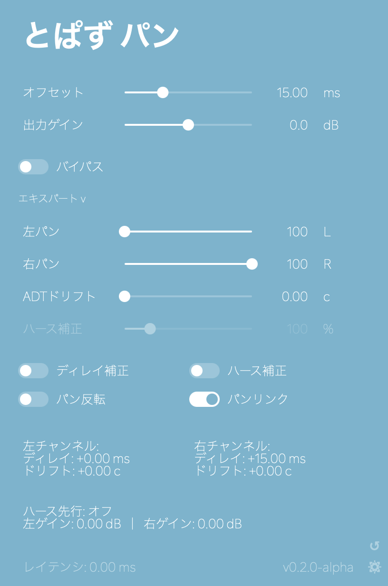

<p align="center">
  
</p>

<p align="center">
  とにかくシンプルなボーカルワイドナープラグイン。
</p>

<p align="center">
  <a href="./README.md">English</a> · <strong>日本語</strong>
</p>

<p align="center">
  <a href="https://github.com/Pachii/topaz-pan/releases">
    
  </a>
  <a href="https://github.com/Pachii/topaz-pan/actions/workflows/build-vst3.yml">
    
  </a>
  
  
  <a href="https://github.com/Pachii/topaz-pan/stargazers">
    
  </a>
</p>

<p align="center">
  <a href="https://github.com/Pachii/topaz-pan/releases">releases</a>
  ·
  <a href="#なぜ作ったのか">なぜ作ったのか</a>
  ·
  <a href="#インストール">インストール</a>
  ·
  <a href="#ソースからビルド">ソースからビルド</a>
  ·
  <a href="#コントリビュート">コントリビュート</a>
</p>

---

ハモリを広げるために、トラックを複製せずに使える小さなプラグインです。

ハース効果をベースにしたワイドニング、必要に応じた `ADTドリフト` によるデコリレーション、`左パン` / `右パン`、任意の左右音量補正をまとめています。追加の調整は `エキスパート` に入っています。

## なぜ作ったのか

このプラグインは、歌ってみた界隈でよく使われるバックコーラスの広げ方を、できるだけそのまま再現しやすくするために作りました。かなり自然に広がったハモリを作ることができます。

やっていること自体は、とてもシンプルです。

1. ボーカルトラックを複製する
2. 片方をほんの少しだけ後ろにずらす
3. 2 本を左右に振る

「そんなので本当に広がるの？」と思うかもしれませんが、まふまふのミックス動画でも、まさにこの方法が使われています。

[https://www.youtube.com/watch?v=pwHqy9cKi7c&t=2604s](https://www.youtube.com/watch?v=pwHqy9cKi7c&t=2604s)

歌ってみたやその周辺の文脈を知らなくても大丈夫です。バックボーカルやハモリを自然に広げたい場面であれば、普通に使えます。ここで歌ってみたの話題に触れているのは、このやり方がその界隈ではかなり定番だからです。

そしてここからが本題ですが、この手法を普通に DTM でやろうとすると、地味に手間がかかります。

* ハモリトラックを複製する
* かなり拡大して、片方を細かくずらす
* 左右にパンする
* 後から直しが入ったら、複製した側ももう一度修正する
* Melodyne などの補正作業まで含めるとさらに面倒
* トラック数が増えてプロジェクトが散らかる

この問題を解決しようとするプラグインはいくつかありますが、この「ただ複製して少しずらしたいだけ」という用途には意外と噛み合いませんでした。

* **iZotope Vocal Doubler** は一応それっぽいですが、設定や挙動がそこまで素直ではなく、位相の違和感やピッチの揺れ、場合によっては歪みが出ることもあります。
* **Soundtoys MicroShift** はかなり優秀ですが、価格が高く、またこの用途に完全特化しているわけではありません。

要するに、「音を複製して少し時間差をつけるだけ」のシンプルなプラグインが意外と見当たらなかったので、自分で作りました。

このプラグインでは、各パラメータが音に対して何をしているのかが分かりやすいように設計しています。ブラックボックス的な処理や過度なモジュレーションは入れていません。追加機能はありますが、不要であればすべてオフにできます。実際、元の手順をそのまま再現したい人向けに、追加機能はすべてデフォルトでオフになっています。

極端に言えば、「DTM 上で手作業で複製してずらした結果」にかなり近い挙動になります。ただし、複製トラックを管理する手間はありません。

---

## スクリーンショット



---

## 仕組み

大まかには、次の 3 つを組み合わせています。

* 少しの時間差
* 左右への配置
* 必要に応じたレベル補正

この組み合わせだけでも、ハモリやダブルはかなり広く聞こえます。

### ハース効果

ワイドニングの中心にあるのは、いわゆる「ハース効果」です。片側の音がもう片側よりほんの少しだけ遅れて届くと、耳はそれをエコーとしてではなく、広がりや方向感として認識します。

### ハース補正

片側だけを遅らせると、遅らせていない側のほうが大きく聞こえ、定位が偏って感じられることがあります。このコントロールは、その偏りを抑えるために左右の音量を同時に調整します。

`ハース補正` は実験的機能で、今後仕様が変わる可能性があります。元の手作業に近い使い方をしたい人向けに `エキスパート` ではデフォルトでオフにしてあり、必要な場合だけオンにして好みに合わせて調整できます。

---

## パラメータ

初期表示のメイン画面では、`オフセット`、`出力ゲイン`、`バイパス` だけを見せています。
それ以外の調整は `エキスパート` を開くと表示されます。

| Control                  | 説明                                       |
| ------------------------ | ---------------------------------------- |
| `オフセット`            | 幅を作るためのハース・ディレイ量を設定します。初期値は `15 ms` です。 |
| `出力ゲイン`            | 最終出力レベルを調整します。                           |
| `左パン` / `右パン` | 左右の配置を決めます。初期状態ではリンクされています。              |
| `ADTドリフト`            | 左右チャンネルに ADT 風の微小ドリフトとデコリレーションを加えます。実験的機能で、今後仕様が変わる可能性があります。`エキスパート` ではデフォルトでオフです。 |
| `ハース補正`              | ハース効果による左右の聴感上の音量差を、どれくらい補正するかを調整します。実験的機能で、今後仕様が変わる可能性があります。`エキスパート` ではデフォルトでオフです。         |

| Toggle              | 説明                                                                                            |
| ------------------- | --------------------------------------------------------------------------------------------- |
| `ディレイ補正`       | 片側だけを遅らせる代わりに、時間差の中心を揃える考え方です。ボーカルがほんの少しだけ後ろに感じるのを抑えたい場合に有効です。オン時、レイテンシーが発生しますが、ホスト側で自動補正されます。 |
| `パンリンク`          | 左右パンを連動させます。オフにすると左右を独立して操作できます。                                                              |
| `パン反転`          | 左右チャンネルを入れ替えます。                                                                               |
| `ハース補正`         | ハース補正のオン / オフを切り替えます。                                                                   |
| `バイパス`            | プラグイン全体をバイパスします。                                                                              |

### とりあえずの使い方

1. 広げたいボーカルトラック、またはボーカルバスに `topaz pan` を挿します。入力はモノラル / ステレオの両方に対応し、出力はステレオです。
2. `オフセット` を好みに合わせて調整します。目安としては 10〜25ms 前後が使いやすく、初期値は `15 ms` です。
3. まずはそれだけで十分です。細かく詰めたいときだけ `エキスパート` を開いて調整してください。

### ADTドリフト について

`ADTドリフト` は、Artificial Double Tracking のように、左右チャンネルへごく小さなピッチの揺れとタイミングのズレを加えて、完全に重なりすぎないようにする機能です。左右の相関を少し崩す補助として使えます。

これも実験的機能で、今後仕様が変わる可能性があります。元の手作業に近い使い方をしたい人向けに `エキスパート` ではデフォルトでオフになっているので、必要な場合だけオンにして好みに合わせて調整してください。レイテンシーが発生しますが、ホスト側で自動補正されます。

---

## インストール

配布ファイルは [releases page](https://github.com/Pachii/topaz-pan/releases) からダウンロードできます。

### macOS

* **VST3**: `/Library/Audio/Plug-Ins/VST3`
* **AU**: `/Library/Audio/Plug-Ins/Components`

### Windows

* **VST3**: `C:\Program Files\Common Files\VST3`

### Linux

* **VST3**: `~/.vst3` または `~/.local/share/vst3`

Linux 版は現在のところ配布していますが、**未検証**です。

### インストーラー

現在のリリースには、以下が含まれています。

* Logic Pro 向け AU / VST3 をまとめた macOS installer
* VST3 用の Windows installer
* Linux 用 VST3 の `.zip`
* 手動インストール用の `.zip`

---

## ソースからビルド

このプロジェクトは **CMake** と **JUCE** を使用しています。

現在の構成では、configure 時に JUCE を自動取得します。

```bash
cmake -S . -B build
cmake --build build
```

### 必要なもの

* CMake
* C++20 に対応したツールチェイン
* macOS: Xcode / Apple Clang
* Windows: Visual Studio / MSVC（JUCE プラグインビルド推奨）
* Linux: GCC / Clang と X11 / 音声周りの開発パッケージ

### ビルドされるもの

プラットフォームに応じて、以下がビルドされます。

* `VST3`
* `AU`
* `Standalone`

---

## コントリビュート

コントリビューション歓迎です。

バグを見つけた、機能の提案がある、DSP や UI を改善したいなどの場合は、issue または pull request を送ってください。

バグ報告の際は、次の情報があると助かります。

* 使用 DTM
* OS
* plugin format
* 発生した問題
* 可能であれば再現手順

大きめの変更を入れる場合は、事前に issue を立てて相談していただけると助かります。

---

## リリース

リリース一覧:

[https://github.com/Pachii/topaz-pan/releases](https://github.com/Pachii/topaz-pan/releases)

現在配布している内容:

* macOS VST3
* macOS AU
* Windows VST3
* Linux VST3
* macOS installer
* Windows installer

Linux 版は現時点では **未検証** です。

---

## ライセンス

このプロジェクトは MIT License で公開しています。全文は [LICENSE](LICENSE) を参照してください。

---

<p align="center">
  built with JUCE
</p>

<p align="center">
  <a href="https://github.com/Pachii/topaz-pan">github.com/Pachii/topaz-pan</a>
</p>
